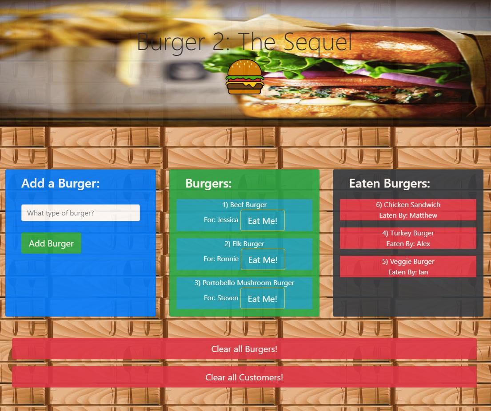

# Burger-2-The-Sequel

## Live Link

[Live Website Link](https://burger-2-the-sequel-sandesh.herokuapp.com/)


## Description

This application is a full-stack application utilizing HTML/CSS/Bootstrap/Handlebars for the front-end. It follows a MVC design pattern with the use of Node, Express, Sequelize as the ORM and it uses MySQL as the database.

* The user has the option to add a burger in the form section on the left side of the page.
    * After the user has put in a **burger name** the form will prompt the user for their **customer name**.
* The **burger name** along with the **customer's name** will get added to the burger list in the middle of the page.
    * This burger will have the option of **"Eat Me!"** next to it. Which clicked on will move it to the eaten burgers section on the right side of the page.
* The **burger** will be in the eaten burgers section along with the **customer** who has eaten the burger.
* The app stores all the burgers and the customers in the database whether they have been eaten or not.


## Overview



## Local Setup

**Step 1 - Clone my repo using the command line below.**
```
git clone https://github.com/SandeshCharka/Burger-2-The-Sequel.git
```
**Step 2 - Change directory to the cloned repo folder.**
```
cd Burger-2-The-Sequel
```
**Step 3 - Install all required NPM packages.**
```
npm install
```
**Step 4 - Set up mySQL database.**
```
Eat-Da-Burger
│
├── config
│   └── config.json
│        
│       -Edit the config.json file to fit your database setup.
│ 
└── db
    └── schema.sql

        -Run the Schema file in mySQL.
```
**Step 5 - Start the application server using the command line below**
```
node server.js
```

## Technologies Used

* Node JS
* Javascript
* Heroku
* Bootstrap
* Handlebars
* Sequelize
* NPM Packages:
    - express
    - express-handlebars
    - mysql

## Role in development

Sole developer of application.
